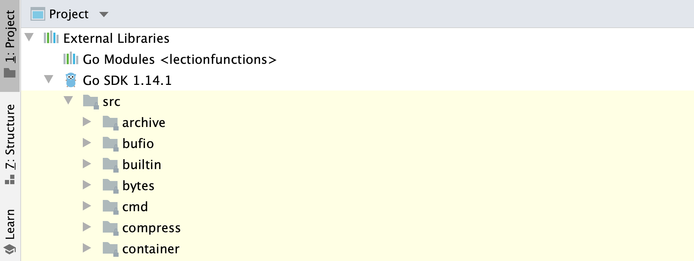
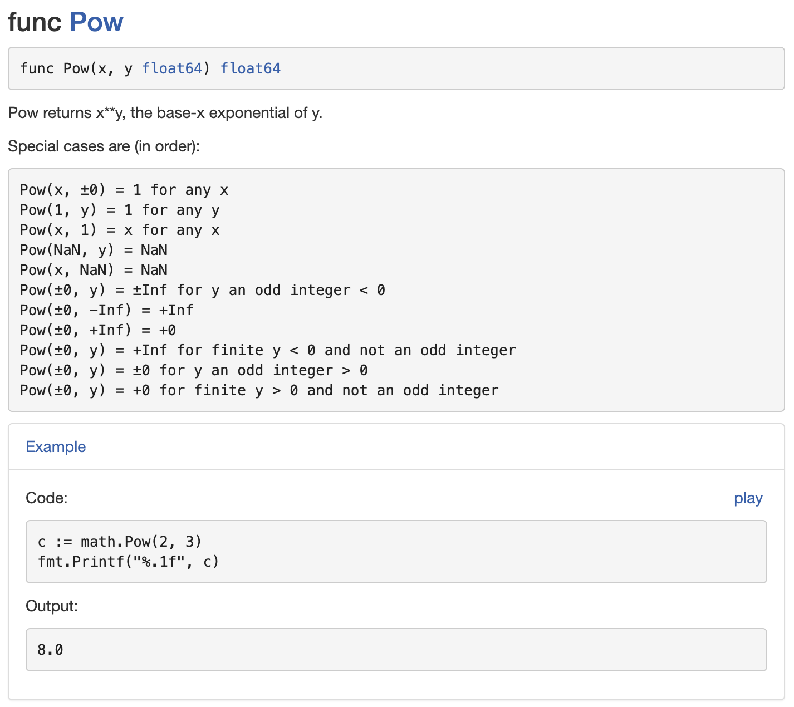

# Домашнее задание к занятию «1.2. Функции, приведение типов, пакеты, модули»

В качестве результата пришлите ссылки на ваши GitHub-проекты в личном кабинете студента на сайте [netology.ru](https://netology.ru).

Все задачи этого занятия нужно делать в **одном репозитории**.

**Важно**: если у вас что-то не получилось, то оформляйте Issue [по установленным правилам](../report-requirements.md).

## Как сдавать задачи

1. Создайте на вашем компьютере Go-модуль (читайте в [инструкции по установке Go и GoLand](../installation.md))
1. Инициализируйте в нём пустой Git-репозиторий
1. Добавьте в него готовый файл [.gitignore](../.gitignore)
1. Добавьте в этот же каталог остальные необходимые файлы (убедитесь, что они аккуратно разложены по пакетам)
1. Удостоверьтесь, что вы правильно отформатировали файлы (см. раздел Форматирование из [первого ДЗ](../01_std))
1. Сделайте необходимые коммиты
1. Создайте публичный репозиторий на GitHub и свяжите свой локальный репозиторий с удалённым
1. Сделайте пуш (удостоверьтесь, что ваш код появился на GitHub)
1. Ссылку на ваш проект отправьте в личном кабинете на сайте [netology.ru](https://netology.ru)
1. Задачи, отмеченные, как необязательные, можно не сдавать, это не повлияет на получение зачета (в этом ДЗ все задачи являются обязательными)

## Задача №1 - Кредит

### Легенда

Банк, для которого мы разрабатываем всякие разные системы, решил разработать калькулятор потребительского кредита.

Конечно же, вы понимаете, что это можно сделать и на фронтенде силами JS, но мы попробуем реализовать его на Go.

Вы, наверное, уже устали от простых задачек, поэтому мы поставим эту задачу в той же формулировке, в которой она часто ставится в реальной жизни: вам дают формулы и примеры расчёта, всё остальное вы делаете сами (включая "вникание в предметную область").

Итак, есть формула расчёта [аннуитетных платежей](https://ru.wikipedia.org/wiki/%D0%90%D0%BD%D0%BD%D1%83%D0%B8%D1%82%D0%B5%D1%82) по кредиту: https://www.banki.ru/wikibank/annuitetnyie_plateji_po_kreditu/

Есть также пример расчёта: https://www.banki.ru/wikibank/raschet_annuitetnogo_plateja/ (обратите внимание, что в примере получилась сумма **37 184** рубля).

А есть калькулятор, на котором можно проверить данные: https://www.banki.ru/services/calculators/credits/?amount=1000000&currency=RUB&period=1095&rate=20

Но вот что интересно, в калькуляторе **немного** другие суммы:


Почему так вышло - сейчас не принципиально. Вы считаете по формуле расчёта (результат работы вашей функции должен совпадать с данными расчёта по формулам, не по калькулятору).

Что нужно сделать:
1. Вам нужно оформить стандартную структуру проекта
1. Написать функцию `Calculate` в пакете `credit`, которая принимает ровно те же данные, что в калькуляторе и возвращает так же три значения: 
    1. Ежемесячный платёж
    1. Переплату для кредита
    1. Общую выплату

Используйте именованные возвращаемые значения (и ни в коем случае не используйте `float32`/`float64` для денежных расчётов).

Примечание*: вы, конечно же, помните, что считать нужно в копейках, а о выводе в рублях позаботиться уже фронтенд.

Чтобы возвести что-то в степень, вам следует ознакомиться с пакетом `math` (в нём есть функция `Pow`).

Сделать это можно либо в самом GoLand (читая исходники пакета `math`):


Либо на сайте с документацией: https://pkg.go.dev/math?tab=doc

Итого: у вас должен быть репозиторий на GitHub, в котором расположен ваше приложение, аккуратно разделённое на пакеты.

**Важно**: если у вас по каким-то причинам недоступны страницы сайта banki.ru, вы можете воспользоваться сохранёнными копиями в каталоге [pic](pic).

P.S. Мы знаем всю критику, которая может прозвучать в ответ на постановку задач в "нечётком формате". Но мы сознательно на это идём, поскольку наша задача - сделать так, чтобы после нашего курса вы могли работать программистом, а это в сегодняшних условиях подразумевает навыки анализа, в том числе. Если вы устроитесь на работу в компанию, в которой идеально выстроен процесс постановки задач и вам приходят чёткие ТЗ, где всё расписано - отлично. Если же вы попадёте в компанию, в которой всё наоборот, вы будете готовы.

## Задача №2 - Examples

### Легенда

Менять в коде вручную данные и каждый раз запускать свои функции с разными данными не так уж приятно.

И даже если вы сделаете нечто вроде*:

```go
func main() {
    monthly, over, total := credit.Calculate(1_000_000_00, 36, 20)
    fmt.Println(monthly == 37_184_00)
    fmt.Println(over == 338_623_00)
    fmt.Println(total == 1_338_623_00)
}
```

Это будет не совсем удобно, потому что "глазами" нужно искать все `true`/`false`, а потом ещё выяснять, на каком именно значении не сошлось.

Примечание*: мы не стали портить вам удовольствие посчитать результаты самим и просто взяли из примера расчёта без копеек.

Чтобы облегчить эту задачу, в Go внедрили специальный инструмент, который называется [Examples](https://blog.golang.org/examples).

Как он работает? Вы просто создаёте в том же пакете файл с именем `example_test.go` (на самом деле примеры можно называть по-разному, но мы для простоты будем использовать этот).

Содержимое этого файла:
```go
package credit_test // взяли пакет credit, добавили _test

import (
    "credit"
    "fmt"
)

func ExampleCalculate() { // имя функции - Example + имя проверяемой функции
    fmt.Println(credit.Calculate(1_000_000_00, 36, 20))
    fmt.Println(credit.Calculate(10_000_00, 36, 20))
    // Output:
    // 3718400 33862300 133862300
    // 37184 338623 1338623
}
```

Как это вообще работает? Go Tools (а именно `go test`) будет искать все файлы с суффиксом `_test` в названии и запускать в них все функции, которые начинаются с `Example`.

Для этих функций он будет сравнивать всё, что выводится (в нашем случае через `fmt.Println`), с тем, что написано в специальном комментарии `// Output:`.

Если значения совпадут, то этот инструмент скажет: `ok`. Если же не совпадёт хотя бы одно, то он скажет `FAIL` и покажет, что точно не совпало.

Чтобы это запустить, нужно открыть терминал и запустить команду `go test -v ./...`.

Странная запись `./...` означает, что такие тесты нужно искать не только в текущем каталоге (терминал по умолчанию открывается в каталоге вашего проекта), а во всех вложенных.

Эти же примеры можно оформить как документацию, например, в пакете `math`:



Примечание*: о том, как оформлять документацию, мы с вами поговорим чуть позже.

Пример оформленного example вы можете найти в репозитории с кодом к сегодняшней лекции.

Итого: у вас должен быть репозиторий на GitHub, в котором:
1. Расположен ваш Go-модуль с кодом (из предыдущего задания)
1. Pull-Request с example, в котором есть минимум два примера (один - эталонный из расчёта с banki.ru*, второй - любой другой на ваш вкус)

Примечание*: если вам при постановке задачи передаётся Заказчиком пример, обязательно включайте его в тесты, иначе Заказчик будет сильно сомневаться в вашем профессионализме: он дал вам пример с расчётом, а ваша программа "не считает". У вас должен либо сходиться расчёт, либо должен быть ответ, почему "не сходится".

## go vet

**Важно: это не ДЗ, сдавать его в виде ДЗ не нужно**.

Вы можете использовать это в каждом ДЗ.

В Go Tools есть инструмент `go vet`, который позволяет проверить ваш код на некоторые наиболее распространённые ошибки.

Почитать информацию об этом инструменте можно на странице https://golang.org/cmd/vet/.

То, что делает `go vet` называется статическим анализом: ваш код без запуска на исполнение проверяется на наличие типовых конструкций.

Иногда это позволяет отловить те ошибки, которые не находит компилятор.

Запускать этот инструмент можно аналогично `go fmt`:

```shell
$ go vet ./...
```

Если, например, в коде присутствует неправильное использование example, то `go vet` его найдёт:

```go
func ExampleCalc() { // у нас нет функции Calc, есть только Calculate
    fmt.Println(credit.Calculate(1_000_000_00, 36, 20))
    fmt.Println(credit.Calculate(10_000_00, 36, 20))
    // Output:
    // 3718400 33862300 133862300
    // 37184 338623 1338623
}
```

Естественно, пример с example, наверное, самый "безобидный" из всех.

Более подробную информацию о `go vet` можно получить из справки (`go help vet`).
