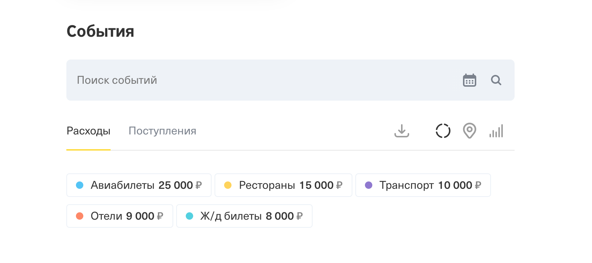
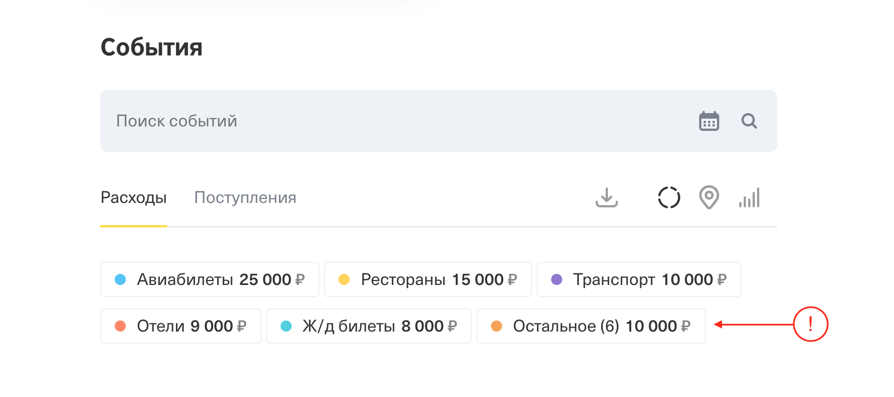
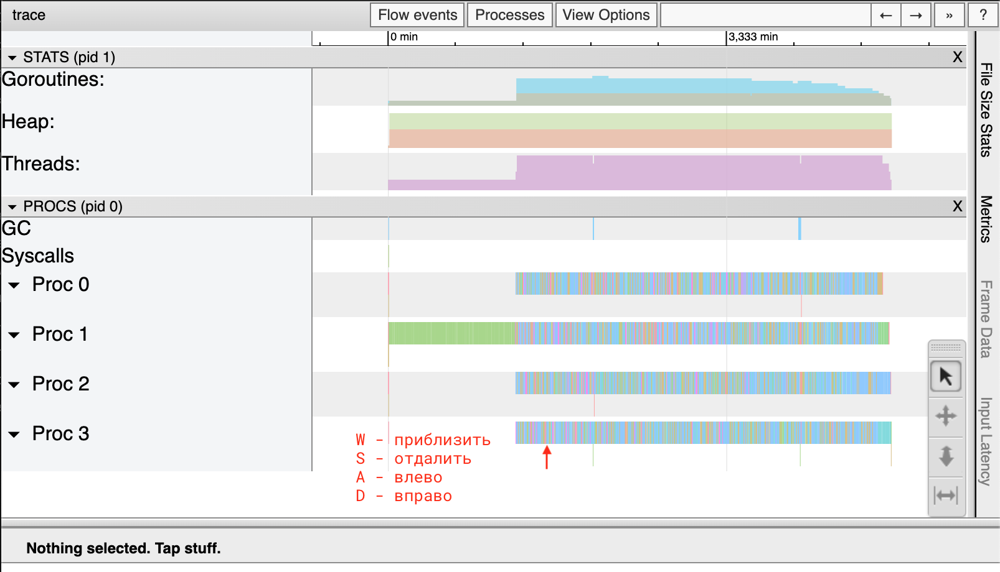
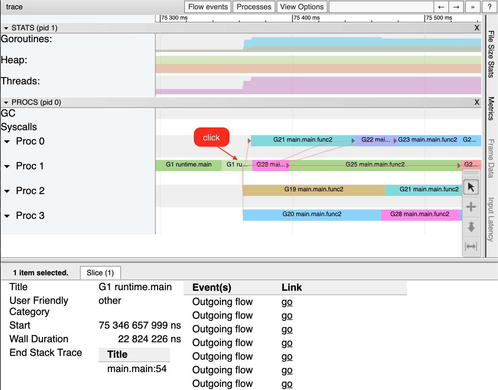
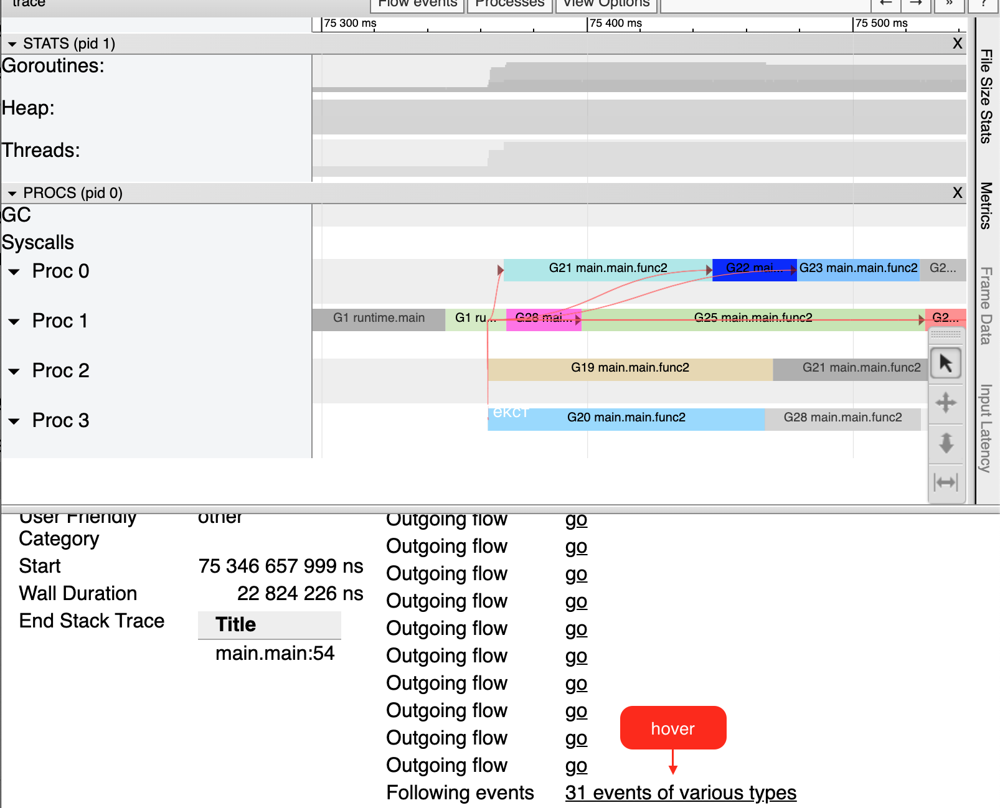

# Домашнее задание к занятию «2.4. Каналы и контекст»

В качестве результата пришлите ссылки на ваши GitHub-проекты в личном кабинете студента на сайте [netology.ru](https://netology.ru).

Все задачи этого занятия нужно делать в **разных репозиториях**.

**Важно**: если у вас что-то не получилось, то оформляйте Issue [по установленным правилам](../report-requirements.md).

**ВАЖНО**: НИ В КОЕМ СЛУЧАЕ НЕ ПОДСТАВЛЯЙТЕ ДАННЫЕ СВОИХ РЕАЛЬНЫХ КАРТ В КОД! Это очень частая "оплошность", когда разработчики случайно коммитят и заливают на GitHub "чувствительные" (sensitive) данные (ключи, логины, пароли, адреса и т.д.). Используйте генераторы вроде: https://www.freeformatter.com/credit-card-number-generator-validator.html

Если вы всё же "случайно" залили чувствительные данные на GitHub, то используйте [инструкцию по удалению данных](https://help.github.com/en/github/authenticating-to-github/removing-sensitive-data-from-a-repository). Кроме того, как бы это печально не было, рекомендуем вам заблокировать карту и заказать в банке новую.

## Как сдавать задачи

1. Создайте на вашем компьютере Go-модуль (см. доп.видео к первой лекции)
1. Инициализируйте в нём пустой Git-репозиторий
1. Добавьте в него готовый файл [.gitignore](../.gitignore)
1. Добавьте в этот же каталог остальные необходимые файлы (убедитесь, что они аккуратно разложены по пакетам)
1. Удостоверьтесь, что вы правильно отформатировали файлы (см. раздел Форматирование из [первого ДЗ](../01_std))
1. Сделайте необходимые коммиты
1. Создайте публичный репозиторий на GitHub и свяжите свой локальный репозиторий с удалённым
1. Сделайте пуш (удостоверьтесь, что ваш код появился на GitHub)
1. Ссылку на ваш проект отправьте в личном кабинете на сайте [netology.ru](https://netology.ru)
1. Задачи, отмеченные, как необязательные, можно не сдавать, это не повлияет на получение зачета (в этом ДЗ все задачи являются обязательными)

## Предисловие

Ключевой темой ДЗ будет являться работа с mutex'ами и каналами, а также написание бенчмарков на наш код. Это позволит вам "примерно" сравнивать скорость работы разных подходов.

Обратите внимание: если у вас ноутбук или вы параллельно с прогоном бенчмарков слушаете музыку/смотрите видео, то результаты будут в буквальном смысле "скакать".

Кроме того, нужно чётко понимать, а что вы конкретно измеряете: например, если вы меряете скорость каналов vs скорость mutex'ов, то нужно понимать, что у вас должно быть много пересылок по каналам и много mutex'ов. В противном случае, другие действия (суммирование например) будет занимать настолько больше времени, что влияние mutex'ов или пересылки по каналам вообще не скажется на фоне общей картины.

## Задача №1 - Расходы по категориям

Мы возьмём с вами идею предыдущих задач (расчёт статистики по транзакциям), но считать будем не сумму транзакций, а расходы по категориям. 

Для этого вам придётся взять с пыльной полки знания об MCC и, возможно, даже ваши наработки. Хотя вы, конечно, можете обойтись без MCC и как-то хранить в транзакции категорию, но это уже ваше дело - вы автор и проектировщик программы.

<details>
<summary>Подсказка</summary>
    
Возможно, просто стоит несколько MCC объединить в одну категорию. Вроде как вы даже писали как-то такую функцию в своё время.    
</details>

Важно: если вы заметили, мы специально так делаем, периодически "возвращая" вас к тому коду, который вы уже писали. Когда вы работаете в долгосрочных проектах - это всегда будет возникать (как и старая шутка о том "кто вообще писал этот ужасный код?!"). Поэтому привыкайте к тому, что код не исчезает бесследно - с большой долей вероятности его придётся поддерживать и использовать в новых задачах и проектах и у вас не всегда будет время "переписать всё правильно". Это реалии мира разработчиков, к ним нужно быть готовым: с одной стороны - не так много времени, чтобы писать всё идеально, с другой стороны - потом могут не дать времени переписать всё нормально. Поэтому выбирайте золотую середину.

Соответственно, мы хотим сделать следующую вещь: так же как на лекции у нас есть миллион транзакций (но если у нас были числа - у вас настоящие транзакции с MCC и т.д.).

Вам нужно собрать траты по категориям, примерно так, как это происходит в Интернет-Банке:


Скриншот Интернет-Банка Тинькофф.

<details>
<summary>Подсказка</summary>
    
Обратите внимание: в личном кабинете конкретного пользователя показываются только его транзакции (а не всего банка), значит, вам нужно ещё и фильтровать их по конкретному пользователю.
</details>

Соответственно, если мы внимательно посмотрим, то у нас формат: ключ (название категории) и значение (сумма). А значит, мы можем использовать `map` для хранения, но для отображения нужен будет всё равно слайс.

<details>
<summary>Почему слайс?</summary>

Всё дело в том, что создатели Go специально сделали так, что вы не можете полагаться на порядок того, как хранятся элементы в `map` (если будете использовать `for range`).

А если вы внимательно приглядитесь к выводу, то увидите, что порядок зависит от суммы: т.е. категория с большей суммой находится первее.




P.S. На самом деле мы немного "наврали" и в реальной системе всё чуть хитрее, а именно какие-то категории по определённому алгоритму собираются в "Остальное" и ставятся всегда последними (но мы так не будем усложнять):


</details>

Соответственно: нам от вас нужно 5 вариантов решения (сделайте 5 функций):
1. Обычная функция, которая принимает на вход слайс транзакций и id владельца - возвращает `map` с категориями и тратами по ним (сортировать они ничего не должна)
1. Функция с mutex'ом, который защищает любые операции с `map`, соответственно, её задача: разделить слайс транзакций на несколько кусков и в отдельных горутинах посчитать map'ы по кускам, после чего собрать всё в один большой `map`. Важно: эта функция внутри себя должна вызывать функцию из п.1
1. Функция с каналами, соответственно, её задача: разделить слайс транзакций на несколько кусков и в отдельных горутинах посчитать map'ы по кускам, после чего собрать всё в один большой `map` (передавайте рассчитанные куски по каналу). Важно: эта функция внутри себя должна вызывать функцию из п.1
1. Функция с mutex'ом, который защищает любые операции с `map`, соответственно, её задача: разделить слайс транзакций на несколько кусков и в отдельных горутинах посчитать, но **теперь горутины напрямую пишут в общий `map` с результатами**. Важно: эта функция внутри себя **не должна** вызывать функцию из п.1

Q: чем 2 отличается от 4?

A: тем, что 2 сначала делает "свою работу" и только потом готовый кусок складывает в `map`, а 4 сразу кладёт в `map`. Соответственно, вы должны посмотреть разницу.

Вы можете посмотреть готовые шаблоны реализации, которые помогут вам справиться с ДЗ.

<details>
<summary>Шаблоны реализации</summary>

Второй вариант:
```go
wg := sync.WaitGroup{}
mu := sync.Mutex{}
result := make(map[string]int64)

for ... { // TODO здесь ваши условия разделения
    wg.Add(1)
    part : = transactions[x:y] 
    go func() {
        m := Categorize(part)

        mu.Lock() 
        // TODO: вы перекладываете данные из m в result
        // TODO: подсказка - сделайте цикл по одной из map и смотрите, есть ли такие ключи в другой, если есть - прибавляйте
        mu.Unlock()
        wg.Done()
    }()
}
wg.Wait()

return result
```

Третий вариант:
```go
result := make(map[string]int64)
ch := make(chan map[string]int64)

for ... { // TODO здесь ваши условия разделения
    part : = transactions[x:y] 
    go func(ch chan <- map[string]int64) {
        ch <- Categorize(part)
    }(ch)
}

finished := 0
for value := range result {
    // TODO: вы перекладываете данные из m в result
    // TODO: подсказка - сделайте цикл по одной из map и смотрите, есть ли такие ключи в другой, если есть - прибавляйте
    finished++
    if finished == partsCount {
        break
    }
}

return result
```

Здесь отдельно стоит отметить, что текущая реализация - это реализация "для бедных". Поскольку мы пока не знаем всех возможностей каналов, то мы "вручную" считаем окончания завершения (тот самый `if + break`).

Чуть позже мы пройдём `select` и разберём более интересные варианты организации взаимодействия с использованием множества каналов, а не одного как сейчас. Но для этого пока нет соответствующего контекста, поэтому мы смотрим на простейшие варианты.

Четвёртый вариант:
```go
wg := sync.WaitGroup{}
mu := sync.Mutex{}
result := make(map[string]int64)

for ... { // TODO здесь ваши условия разделения
    wg.Add(1)
    part : = transactions[x:y] 
    go func() {
        for _, t := range part {
            // TODO: 1. берём конкретную транзакцию
            // TODO: 2. смотрим, подходит ли по id владельца
            mu.Lock() 
            // TODO: 3. если подходит, то закидываем в общий `map`
            mu.Unlock()
        }
        wg.Done()
    }()
}
wg.Wait()

return result
```

</details>


Итого, у вас должно быть: оформленный проект с пакетами и тестами, выложенный в репозиторий на GitHub и автотесты.

Тесты обязательно нужны, иначе как вы проверите, что код работает правильно?

Здесь ключевой момент - подготовка тестовых данных.

Сделайте прямо в файле с тестами функцию, которая будет вам генерировать синтетические тестовые данные (всегда одни и те же - без рандома):

```go
func makeTransactions() []int64 {
	const users = 10_000
	const transactionsPerUser = 10_000
	const transactionAmount = 1_00
	transactions := make([]Transaction, users * transactionsPerUser)
	for index := range transactions {
		switch index % 100 {
			case 0:
				transactions[index] = x// Например, каждая 100-ая транзакция в банке от нашего юзера в категории такой-то
			case 20:
				transactions[index] = y// Например, каждая 120-ая транзакция в банке от нашего юзера в категории такой-то
			default:
				transactions[index] = z// Транзакции других юзеров, нужны для "общей" массы
		}
	}
	return transactions
}
```

И просто используйте эту функцию в тестах вместо того, чтобы "хардкодить" данные.

## Задача №2 – Бенчмарки

Бенчмарки - это "тесты производительности". Они позволяют сравнивать несколько реализаций. Причём важны не абсолютные значения показываемых величин, а именно "относительные".

Go Tools фактически засекают, сколько требуется на один запуск вашей функции, правильно высчитывает общий показатель и позволяет вам визуально сравнить.

Важно: на одном прогоне тестировать бессмысленно! Нужно хотя бы тысячу прогонов, чтобы получить более-менее правильные числа.

Бенчмарки пишутся достаточно просто: вы в файле с тестами пишите вот такую структуру (для каждого тестируемого варианта реализации):

```go
// Сокращение GoLand: bench + Tab
func BenchmarkCategorization(b *testing.B) {
    transactions := makeTransactions()
    want := map[string]int64{
        // ожидаемые вами значения
    }
    b.ResetTimer() // сбрасываем таймер, т.к. сама генерация транзакций достаточно ресурсоёмка
    for i := 0; i < b.N; i++ {
        result := Categorize(transactions)
        b.StopTimer() // останавливаем таймер, чтобы время сравнения не учитывалось 
        if !reflect.DeepEqual(result, want) {
            b.Fatalf("invalid result, got %v, want %v", result, want)
        }
        b.StartTimer() // продолжаем работу таймера
   }
}
```

Вместо `testing.T` как в обычных тестах, здесь используется `testing.B`.

И так для каждого варианта, например для конкурентного с mutex'ами:

```go
// Сокращение GoLand: bench + Tab
func BenchmarkCategorizationWithMutex(b *testing.B) {
    transactions := makeTransactions()
    want := map[string]int64{
        // ожидаемые вами значения
    }
    b.ResetTimer() // сбрасываем таймер, т.к. сама генерация транзакций достаточно ресурсоёмка
    for i := 0; i < b.N; i++ {
        result := CategorizeConcurrentlyWithMutex(transactions)
        b.StopTimer() // останавливаем таймер, чтобы время сравнения не учитывалось 
        if !reflect.DeepEqual(result, want) {
            b.Fatalf("invalid result, got %v, want %v", result, want)
        }
        b.StartTimer() // продолжаем работу таймера
   }
}
```

Обратите внимание: внутри бенчмарков мы проверяем результат! Потому что в противном случаем мы можем получить, что "работает очень быстро, но не правильно".

Стоит отметить, что вы не всегда будете видеть `b.ResetTimer`, `b.StopTimer` или `b.StartTimer` - они используются только если у вас достаточно дорогие вычисления, которые могут влиять на результат.

Бенчмарки не запускаются во время прогона простых тестов. Для их запуска нужна специальная команда:

```shell
go test -bench=. -benchtime=1000x ./...
```

`-bench=.` означает, что запускаем все бенчмарки (точка).

`-benchtime=1000x` с суффиксом `x` на конце означает, что запускаем 1000 раз (по умолчанию запускаются на одну секунду). 

После этого вы получите вывод с цифрами и можете подумать, почему получилось так или иначе.

Итого, у вас должно быть: оформленный проект с пакетами и тестами, выложенный в репозиторий на GitHub и бенчмарки.

## Дополнительный материал: tracing

Tracing - это возможность посмотреть, как выполнялась наш код, а именно нас будут интересовать запуск горутин и описание блокировок.

Мы рассмотрим включение tracing'а двумя способами:
1. Через тесты
1. В `main` вашего кода

### Tracing через тесты

Включить tracing через тесты достаточно просто: просто скопируйте приведённый ниже код в ваш файл `main.go` (в самое начало):
```go
f, err := os.Create("trace.out")
if err != nil {
	log.Fatal(err)
}
defer func() {
	if err := f.Close(); err != nil {
		log.Print(err)
	}
}()
err = trace.Start(f)
if err != nil {
	log.Fatal(err)
}
defer trace.Stop()
```

Запустите ваше приложение на исполнение: должен появиться файл `trace.out`.

После чего запустите команду просмотра trace:
```shell
go tool trace trace.out
```

С этой команды мы запустим возможность просмотра результатов через веб-браузер:


Должен открыться браузер по умолчанию, но если этого не произошло, вы можете кликнуть по ссылке.

Нас пока интересует только первый пункт:


Если при открытии вы видите предупреждение (как на скриншоте), то нужно его скрыть:


Теперь самое интересное: как с этим работать:



Вы наводите указатель мыши (на скриншоте красная стрелка) на определённую область и используете клавиши:
* W - приблизить (увеличить масштаб)
* S - удалить (уменьшить масштаб)
* A - влево
* D - вправо

Немного потренировавшись, вы попадёте в точку, где мы стартуем горутины:



Как вы видите, здесь красными линиями отмечено, какие горутины стартуют.

А чуть ниже есть ссылки для перехода к ним:



Потренируйтесь в навигации, поэкспериментируйте с трейсом различных сценариев из первой задачи.

Мы ещё будем обращаться к трейсингу и будем подразумевать, что вы умеете его открывать и перемещаться по нему.

## Дополнительный материал: форматирование

Вы уже наверняка заметили, что в ряде функций на конце есть буква `f`, например:
* `fmt.Printf`
* `t.Errorf`
* `t.Fatalf`
* `b.Fatalf`

Это буква `f` в большинстве случаев означает, что вы можете использовать специальные форматные строки для формирования строк нужно формата.

Все они описаны на странице документации пакета [`fmt`](https://golang.org/pkg/fmt/).

Ключевое: вам не нужно заучивать все. Достаточно уметь смотреть в документацию и находить нужный.

Самые распространённые:
* %s - для строк
* %d - целые числа
* %f - вещественные числа
* %v - представление по умолчанию для конкретного типа (такое же, как было в `fmt.Println`)
* %+v - форматирование структуры вместе с полями

Форматные строки используются не только при печати, но и при формировании строк на базе шаблона.

Например:
```go
message := fmt.Sprintf("Hello %s! Your balance is %.2f rub", "Vasya", 6000.23)
```

Как это работает? На место символа с `%` подставляется аргумент в соответствующем формате представления.

В данном случае, `%.2f` говорит о том, что после запятой нужно выводить всего два символа.

Мы будем использовать эту возможность только при логировании (а чуть позже и обработке ошибок), поэтому вам не нужно заучивать все возможные комбинации.

Обращаем ваше внимание, что достаточно часто вы также встретите использование escape-символов:
* \n - перевод строки
* \t - табуляция
* \\ - слеш

Просто потому, что тот же самый `fmt.Printf` не ставит перевод строки.
