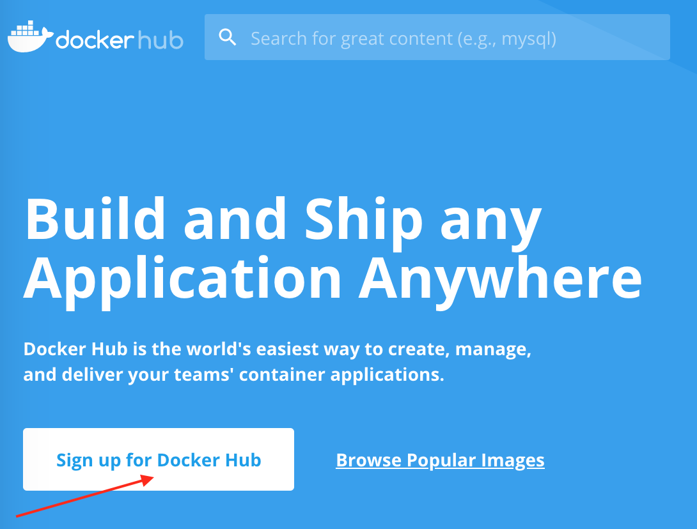
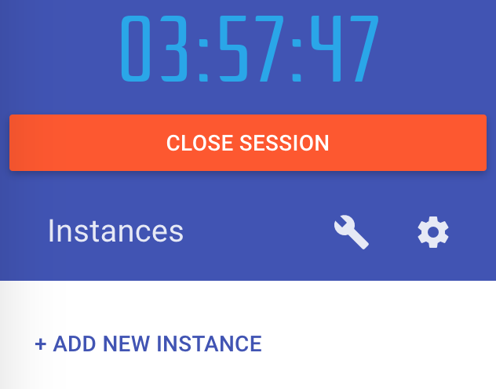
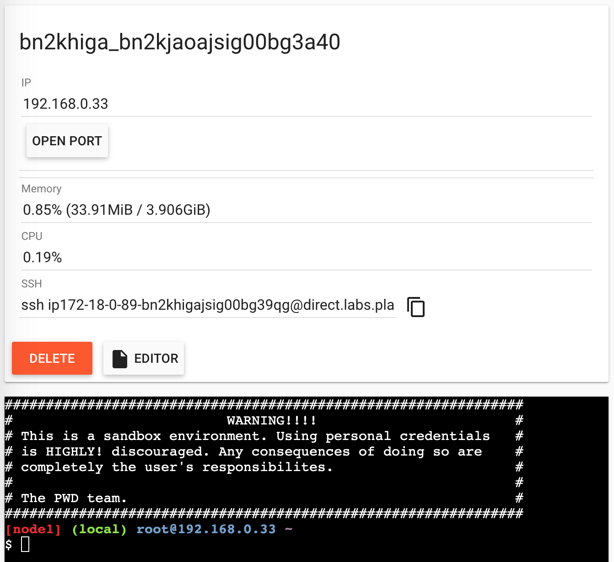

# Инструкция по установке Docker

Первое, что нужно сделать - это зарегистрироваться (получить Docker ID) на [Docker Hub](https://hub.docker.com/).

Выбираете `Sign Up`:



Заполняете форму, регистрируйтесь.

Второе, что нужно сделать - это определиться с вашей ОС и версией:
* Пользователи Windows 7, Windows 10 (ниже PRO) - вам нужен Docker Toolbox. Установка описана [здесь](https://docs.docker.com/toolbox/toolbox_install_windows/)
* Пользователи Windows 10 PRO - вам нужен Docker Desktop. Установка описана [здесь](https://docs.docker.com/docker-for-windows/install/).
* Пользователи MacOS (год выпуска 2010+ и ОС 10.13 и выше) - вам нужен Docker Desktop. Установка описана [здесь](https://docs.docker.com/docker-for-mac/install/)
* Пользователи более старых маков - вам нужен Docker Toolbox. Установка описана [здесь](https://docs.docker.com/toolbox/toolbox_install_mac/)
* Пользователи Linux, в зависимости от дистрибутива: [Ubuntu](https://docs.docker.com/install/linux/docker-ce/ubuntu/), [Debian](https://docs.docker.com/install/linux/docker-ce/debian/). Не забудьте так же про [Post Installation](https://docs.docker.com/install/linux/linux-postinstall/)

**Важно**: замечание для пользователей Docker Toolbox на Windows - вам вместо localhost придётся писать `192.168.99.100`. 

Если работать не будет, то выполните в консоли команду `docker-machine ip default` и увидите адрес (его нужно будет использовать во всех примерах вместо `localhost`).

Q: Что делать, если ничего не получилось?

A: Ничего страшного, будете пользоваться [облачной версией](https://labs.play-with-docker.com/) - нужна учётка Docker ID.

## Работа с Play With Docker

Логинитесь, получаете сессию в несколько часов:



Нажимаете `ADD NEW INSTANCE`, чтобы получить консоль:



Как закинуть туда файлы: там есть Git, поэтому можете просто выложить себе в репо нужные файлы и склонировать (самый простой вариант)

Необходимые приложения вы можете установить через пакетный менеджер apk:
```
apk add go

go version
```

Вы должны увидеть:
```
go version go1.13.14 linux/amd64
```

Далее вам немного нужно будет познакомиться с консольным менеджером tmux, который позволяет вам в одной консоли эмулировать несколько:
```
tmux
```

[Документация по tmux](http://xgu.ru/wiki/tmux)

Вам нужно только вот эти хоткеи:
* Создание нового окна: ctrl + b + c
* Переход на следующее окно (текущее выделено *): ctrl + b + n
* Закрытие текущего окна: ctrl + b + x

Как проверить, что возвращает сервис на запрос GET:
```
curl http://localhost:9999
```

Редактировать файлы `Dockerfile` и `docker-compose.yml` вы можете как прямо в терминале (но тогда вам нужно использовать nano или vim), либо прямо на GitHub'е в режиме редактирования (тогда просто в Playground делаете `git pull` после каждого сохранения).
