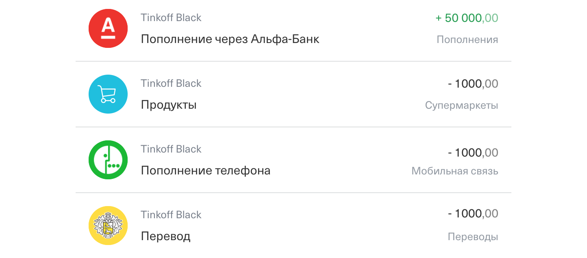

# Домашнее задание к занятию «4.2. Реляционные базы данных - SQL»

В качестве результата пришлите ссылки на ваши GitHub-проекты в личном кабинете студента на сайте [netology.ru](https://netology.ru).

Все задачи этого занятия нужно делать в **одном репозитории**.

**Важно**: если у вас что-то не получилось, то оформляйте Issue [по установленным правилам](../report-requirements.md).

**ВАЖНО**: НИ В КОЕМ СЛУЧАЕ НЕ ПОДСТАВЛЯЙТЕ ДАННЫЕ СВОИХ РЕАЛЬНЫХ КАРТ В КОД! Это очень частая "оплошность", когда разработчики случайно коммитят и заливают на GitHub "чувствительные" (sensitive) данные (ключи, логины, пароли, адреса и т.д.). Используйте генераторы вроде: https://www.freeformatter.com/credit-card-number-generator-validator.html

Если вы всё же "случайно" залили чувствительные данные на GitHub, то используйте [инструкцию по удалению данных](https://help.github.com/en/github/authenticating-to-github/removing-sensitive-data-from-a-repository). Кроме того, как бы это печально не было, рекомендуем вам заблокировать карту и заказать в банке новую.

## Как сдавать задачи

1. Создайте на вашем компьютере Go-модуль (см. доп.видео к первой лекции)
1. Инициализируйте в нём пустой Git-репозиторий
1. Добавьте в него готовый файл [.gitignore](../.gitignore)
1. Добавьте в этот же каталог остальные необходимые файлы (убедитесь, что они аккуратно разложены по пакетам)
1. Удостоверьтесь, что вы правильно отформатировали файлы (см. раздел Форматирование из [первого ДЗ](../01_std))
1. Сделайте необходимые коммиты
1. Создайте публичный репозиторий на GitHub и свяжите свой локальный репозиторий с удалённым
1. Сделайте пуш (удостоверьтесь, что ваш код появился на GitHub)
1. Ссылку на ваш проект отправьте в личном кабинете на сайте [netology.ru](https://netology.ru)
1. Задачи, отмеченные, как необязательные, можно не сдавать, это не повлияет на получение зачета (в этом ДЗ все задачи являются обязательными)

## Задача №1 - DDL

Создайте проект и в файле `schema.sql` опишите базу данных, в которой будет три таблицы:
* `clients` (как на лекции)
* `cards` (как на лекции)
* `transactions` (эту придумываете и описываете сами)

Спроектируйте таблицу транзакций таким образом, чтобы она позволяла хранить информацию следующего вида:

Не забудьте про связи!

**Ключевое**: у этой задачи нет единственно верного решения, поэтому проектируйте так, как было бы удобно хранить и работать вам.

Подсказка

Возможно, стоит сделать не одну таблицу, а две. Например, вторая будет для иконок.

Итого, у вас должно быть: пустой проект с файлом `schema.sql`, выложенный в репозиторий на GitHub и `docker-compose.yml` для поднятия контейнера с СУБД PostgreSQL. 

## Задача №2 - DML

Создайте файл `data.sql`, в котором расположите запросы `INSERT`, наполняющие таблицы из первого запроса данными.

Требования:
1. Должно быть минимум два пользователя
1. У первого пользователя одна карта, у второго две
1. По одной из карт совершены транзакции, указанные на скриншоте из первого задания

Убедитесь, что ваши запросы работают, если их выполнять последовательно (т.е. так, как они расположены в файле).

Итого, у вас должно быть: пустой проект с файлами `schema.sql` и `data.sql`, выложенный в репозиторий на GitHub и `docker-compose.yml` для поднятия контейнера с СУБД PostgreSQL. 

## Задача №3 - docker-entrypoint-initdb.d

Прочитайте [руководство по инициализации баз данных в контейнерах](initdb.md) и переработайте свой `docker-compose.yml` так, чтобы при первом старте контейнера база данных автоматически инициализировалась с помощью файлов `schema.sql` и `data.sql`. 

Итого, у вас должно быть: пустой проект с файлами `schema.sql` и `data.sql`, выложенный в репозиторий на GitHub и `docker-compose.yml` для поднятия контейнера с СУБД PostgreSQL, который инициализирует БД с помощью скриптов `schema.sql` и `data.sql`. 

Подсказка

Возможно, вам придётся переименовать файлы *.sql, чтобы они выполнялись в правильном порядке.

## Дополнительный материал

**Важно**: это не задача, сдавать её не нужно

Не всегда у вас будет под рукой GoLand. Поэтому так же, как и с Git, важно учиться пользоваться командной строкой и консольными клиентами. В [отдельном руководстве](psql.md) мы описали, как можно пользоваться утилитой psql.
